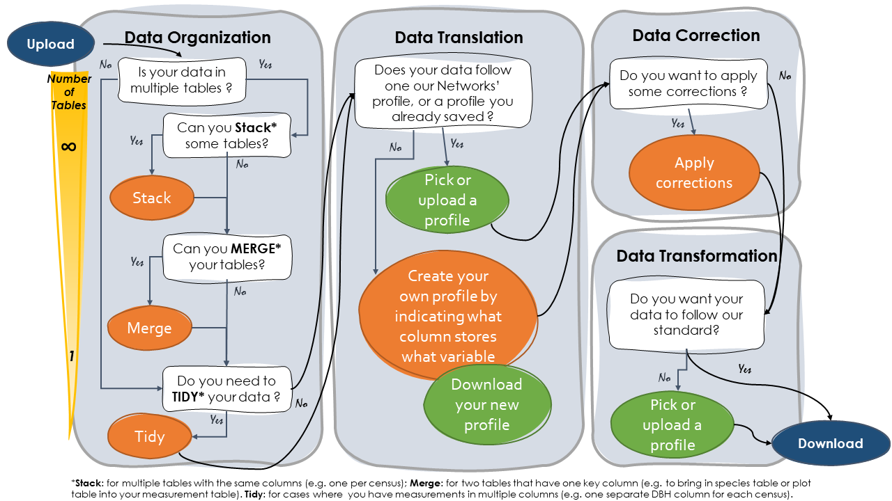

<html>

<head>

<title>App Help</title>
</head>

<body>

<h1>App help</h1>

<!--html_preserve--><!--/html_preserve--><!--html_preserve--> <h1>Uploading your files</h1>

This is an example where we upload two tables, one for tree data and one for plot data.

You need to indicate what is your unit of measurement (plot, species, tree or stem). Here we have tree level data.

Tables have to be .CSV files. 

If your data does not look good when it appears on the right panel, you can click on the little gear icon to specify the the field separator character and whether the file contains the names of the variables as its first line.

You can give your tables a name so they are easily recognizable in the next steps.

  <h1>Stacking tables</h1>

You can stack multiple tables on top of each other, if they have the <strong>same set of columns</strong>, <strong>with exact same names</strong>.

You need to do that if multiple tables represent same measurements made on different sets of trees (e.g. at different plots), or different censuses.

In this example, we uploaded four tables. Three of them are individual census tables, with the same set of columns (Tables <code>Census1</code>, <code>Census2</code>, and <code>Census3</code>. 

To stack our three tables, we select each of them and click <code>Stack Tables</code>. The new <code>unified</code> table appears at the bottom of the page.&ldquo;)

(The fourth table, <code>SpeciesTable</code>, is different, and we will merge its information at the next step.)

  <h1>Merging tables</h1>

In this stage, you can bring data from different tables together. 

You will need to do that if, e.g., your species or your plot information is stored in a different table than your inventory data.

In this example, we have our stacked tables (<code>StackedTables</code> - we stacked data from 3 censuses at the step before), and our species table(<code>SpeciesTable</code>), which has information that we want to merge in our inventory data.

Because we want to keep all the rows of the longer data set, with all the inventory data, we first select<code>StackedTables</code>. We then indicate what column in that dataset is the <code>key</code> column that should be used to link it to our species table. We then do the same to our species table.

NOTE 1: you need to click on the little arrow to be able to see the columns in your tables.

NOTE 2: If you need multiple columns to indicate the <code>key</code> that links the two tables together, you can select multiple columns. If you are doing so, make sure that you select them in the right order.

NOTE 3: If you have more than 2 tables to merge. Start with two. When you click on &ldquo;Merge&rdquo;, you will be prompt to proceed to anoter merging. After this stage, you should be done to 1 table. 

  <h1>Tidying your files</h1>

At this stage, we want to make your data has one row per observation. So if you collected the same type of information in several columns (e.g. you added a column each time you visited a tree, or for each stem of the tree etc&hellip;), we need to &ldquo;tidy&rdquo; that.

First, you need to indicated what was the reason you added new columns for a new observation. In our example, we added a new column for each census, so we select <code>Census ID</code> in stem 1.

Next, you need to indicate what columns are the ones you added for each observation, and what they represent. We tried to help you with that, by detecting the columns that have similar names (like in our case, columns <code>dbh1</code>, <code>dbh2</code>&hellip; indicate the columns for dbh and <code>year1</code>, <code>year2</code>&hellip; indicate the year of each census ) but your columns may have very different names so you may need to indicate them yourself.

  <h1>Indicating the meaning of your headers and your units</h1>

Here, we want to know in what column some key information is stored in your data.

<h2>If&hellip;</h2>

<h3>&hellip; your data follows one of our pre-loaded standards</h3>

You can select it to help filling out some of the general information. But you should double check that accurately describe your particular data set.

(You need to click on the green button twice.)

<h3>&hellip; you have already gone through this step and have save your profile (.rds file)</h3>

You can upload your profile and click on the green button twice. Double check that the information is fille out properly.

<h3>This is your first time on this page</h3>

You have to go down the lists of the left column before indicating more information in the right column.
For each element, select the column that corresponds the best, if any, what is asked.
Once you are done, save your profile (a .rds file) so you won&#39;t need to go through all of this again (see above) 

<h1>Standardizing data</h1>

Once the fields are filled out to the best of your knowledge and you saved your profile (we recommend saving the profile first in case this steps fails), you can click on the &ldquo;Apply changes&rdquo; button. 
Your standardized data will appear. The headers and units are following this app&#39;s standard for now, you can see what those are by clicking the little &ldquo;info&rdquo; button.

  <h1>Defining your tree codes</h1>

This stage is only required if you indicated column(s) for tree codes (in the Tree Measurement in the headers tab).

This table shows the list  of codes that are available in the column(s) you indicated. 
If you intend to translate these codes to match the ones of another profile (which you will be able to do at a later step), or vice-versa, you need to fill this table out.

You can select a pre-loaded definition or enter your own. 

Once you are done with that table you can update your profile (by downloading and overwriting your .rds file).

If you have already saved you profile after this step and used it profile to fill out the previous step, you can click on the &ldquo;Use your profile&rdquo; button to automatically fill the table.

  <h1>Applying corrections</h1>

Here you can detect errors and/or apply all corrections.

When you select &ldquo;Yes&rdquo; to any of these, you will be able to change the default parameters.

These functions will add new columns to your data (indicated with <code>Corr</code> suffix) and won&#39;t alter your original columns.

Note that some of these function are quite slow and it can take a few minutes for the output to show up.

  <h1>Selecting an output profile</h1>

You may select a pre-loaded profile or upload a .rds file that a colleague sent you.
You may also choose to keep this app&#39;s standard by clicking &ldquo;don&#39;t use profile&rdquo;.

The app is currently not able to handle deal with tree/stem &lt;&ndash;&gt; plot/species translation.

  <h1>Translating your tree codes</h1>

If your profile has tree codes and the profile you selected as an output also do, you can look through both sets of codes and indicate when they are equivalent by checking the radio button.

If you hover over the column names, you will see the definitions of the output profile.

click on &ldquo;See definition&rdquo; to double check that the mapping of codes is correct. When you are happy, you can apply the mapping and you will see columns added to your table. They will have the column names that the output profile expect and will be filled with their codes.

  <h1>Downloading the output data</h1>

Clicking on &ldquo;save all&rdquo; generates a zip file with all the files you should need. 
If you have tree codes and applied a tree code mapping, the zip will include files relevant to that

 <!--/html_preserve-->

</body>
</html>
