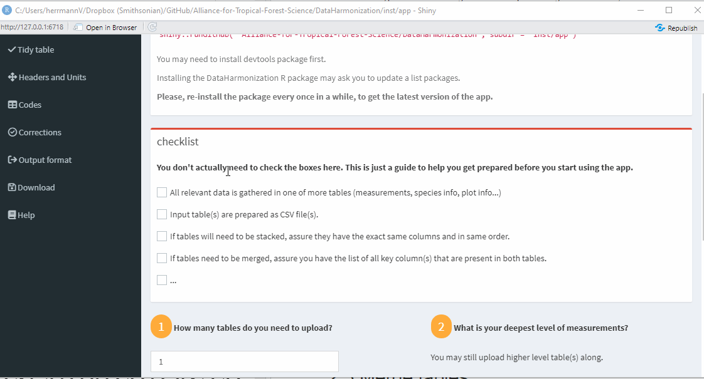
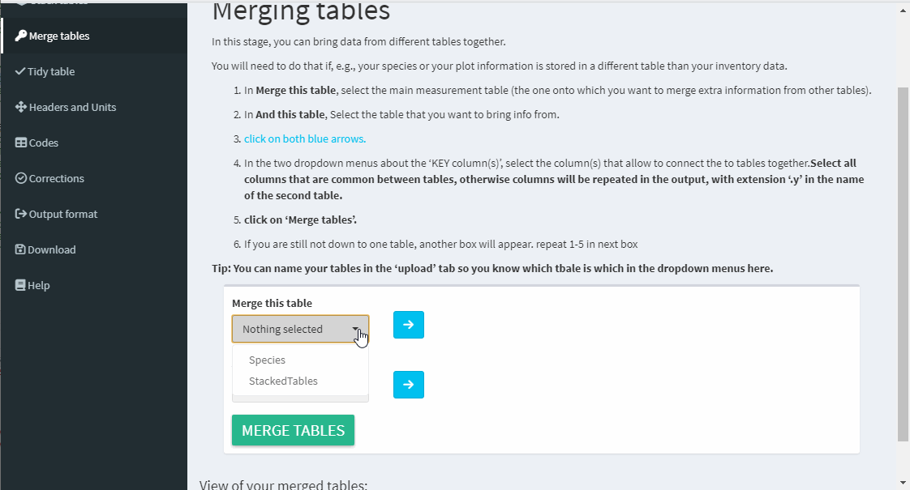
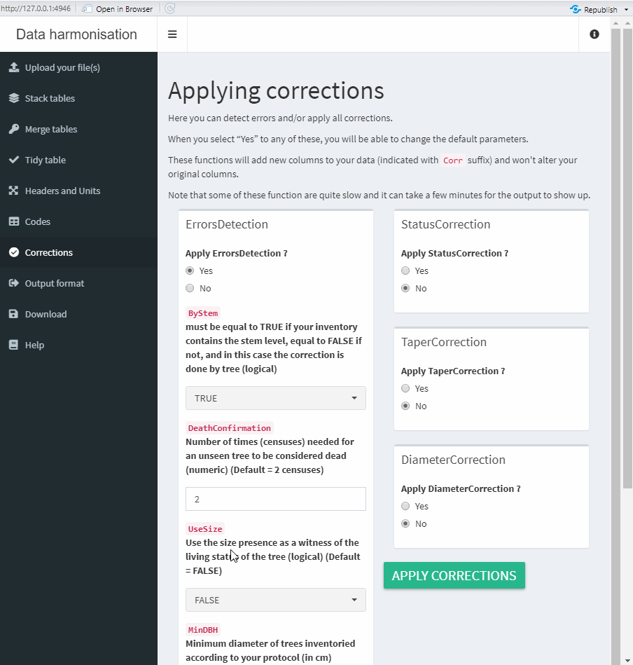

```{r include=FALSE}
library(fontawesome)
``` 


Welcome to the ATFS (Alliance for Tropical Research Science) data harmonization app!


# Intro {#intro}

The app is a tool meant to be used by 2 or more networks that are planing on combining their data for a common analysis.

## Profiles {#profile}

The app relies on "Profiles" that indicate how the data is stored in the file(s) provided: names of columns storing the DBH, the census ID, the tree tag, units of measurements etc...

A profile is a .rds file that is downloaded via the app once all the information about the data has been provided in the [`Headers and Units`](#Headers) tab of the app.

One same profile can be uploaded as "input profile" in the [`Headers and Units`](#Headers) tab, to speed up the process once your network's data has been profiled, and/or as "output profile" in the [`Output format`](#OutputFormat) tab, to transform other networks' data into that profile.

Some networks have their profile stored within the app.

## Getting your data ready {#prepdata}

The app only accepts CSV files. 

It performs best if all the information that you want to share is collated into one analytical file, so we recommend that you append your species and plot information to your measurement information beforehand, and upload that one bigger file into the app.

That said, you can decide to utilize the app to do exactly that. There is no limit to the number of files you can upload but they all need to connect to each other in one way or another, so that by a stacking and/or merging them, it is possible to collate them down to one file. We will get to this in more detail in a moment.

The app also relies on [tidy](https://cran.r-project.org/web/packages/tidyr/vignettes/tidy-data.html#:~:text=Tidy%20data%20is%20a%20standard,Every%20column%20is%20a%20variable.) data, which means that every column is a variable, every row is an observation and every cell is a single value. For example, a data set with multiple column for the DBH measurement (e.g. DBH_2015, DBH_2020 etc...) is not a tidy data set. Instead, there should be a column for the variable `year` (which, in our example, will take a value of 2015 or 2020), and a column for `DBH`.
If your data is not in a tidy format, the [`Tidy table`](#Tidying) tab will help you reshape your data. 


## R package {#package}

The app relies on functions that are maintained in a GitHub R package located here: https://github.com/Alliance-for-Tropical-Forest-Science/DataHarmonization.

## Getting the app to start {#start}

### Running the app on your local machine {#localRun}

We recommend to run the app on your local machine (via R and RStudio) if one of the following cases apply to you:

 - You have poor internet connection
 - You are working with large data files
 - You are familiar with the development of Shiny apps and would like to troubleshoot any issues you may encounter yourself
 
To open the app in R, you will need to install the DataHarmonization R package and launch Shiny with the following lines of code.

```{r}
# install the R package

devtools::install_github("Alliance-for-Tropical-Forest-Science/DataHarmonization", build_vignettes = TRUE)

# run the app

shiny::runGitHub( "Alliance-for-Tropical-Forest-Science/DataHarmonization", subdir = "inst/app") ### DZ: this is not being displayed in the HTML tutorial.
```

Note that you may need to install `devtools` package first and that installing the DataHarmonization R package may ask you to update a list packages.

**You'll want to re-install the package every once in a while, to get the latest version of the app.**

### Running the app online {#onlineRun}

If you don't have R and RStudio and if your data is not too big, you can choose to run the online version of the app by clicking on this [link](https://valentineherr.shinyapps.io/TmFO_AccelNet/). 
Note that online version may be lagging behind the GitHub version. 


# Interacting with the app {#interact}

Once the app is launched you can start interacting with it.

There are multiple tabs to go through. 
Some tabs will be skipped automatically if they don't apply to your situation and you may skip others if you don't need/want them.

When you land on a tab, **always advance with an action button (even if skipping) so your inputs are taken into account**. You may use the navigation panel to return to a previous tab but remember to click on an action button to save your updated entries.


## Upload your file(s) {#upload}

This tab starts with information that we already covered in the [intro](#intro). The checklist is only a guideline to help you getting ready, and you don't actually need to check the boxes to move on.

The numbered tasks are the elements that you do need to complete to be able to move forward.

 1. Indicate how many tables you wish to upload
 2. Indicate the finest level of measurement in your data:
 
    - **Plot**: if your data only consists of plot level measurements like species richness, total basal area, total number of stems etc...
    - **Species**: if your data consists of species level measurements like abundance, basal area etc... This does not prevent you from also uploading plot level information that is stored in a separate file.
    - **Tree**: if your data consists of tree diameters, circumference,... and you are only measuring the main stem of each tree. This does not prevent you from also uploading plot and species level information if they are stored in separate file(s).
    - **Stem**: if your data consists of stem diameters, circumference,... and some stems belong to a same tree. This does not prevent you from uploading plot and species level information if they are stored in a separate file(s).
 
Again, even if you are uploading plot level information but have a stem level data, you should upload that file along and indicate that your level of measurement is "Stem".

 3. Upload you tables. You'll have as many upload boxes as you indicated needing in step 1. For each of them:
 
    - click on `Browse...` and navigate to the csv file you want to upload.
    - Type a more meaningful name to replace the generic "Table1", "Table2" etc... This is particularly useful if you are uploading more than one file.
    - Check on the right hand side that the columns and rows of your data are rendering properly. 
    - In the unlikely event that your tables are not rendering properly, adjust the parameters (separator and header) by clicking on the little gear icon `r fa(name = "cog")`.

 4. **Click on SUBMIT** to proceed to the next step.
 
     



## Stack tables {#Stacking}

If you uploaded more than one table, you will be prompted to the `Stack tables` tab, but this tab will be skipped if you only uploaded one table.

You will need to stack 2 or more tables if you are collecting the same information in multiple files. This can be the case if, for example, you are keeping your measurements from different plots in different files. Or you are keeping one file per census.

If you don't need to stack tables, **click on SKIP THIS STEP**.

**It is important that the files you are stacking have the same set of columns.** 

 1. Select all the tables that need to be stacked
 
 2. **Click on STACK TABLES**
 
 3. Double check your newly created table looks ok
 
 4. **Click on GO TO MERGE** to proceed to the next step. (Note: if you are down to one table at this stage the button's label will change, so **click SKIP MERGING SINCE ALL YOUR DATA IS NOW STACKED**).


## Merge tables {#Merging}

If you uploaded more than one table and not all of them were stacked, you will be prompted to the `Merge tables` tab, but this tab will be skipped if you only uploaded one table, or if all your tables were stacked.

At the end of this stage you have to be down to one table.

You need to use merging if, e.g., your species or your plot information is stored in a different table than your measurement table, and there is at least one "key" column that you can use to connect the tables together.


 
 1. In **Merge this table**, select the main measurement table (the one onto which you want to merge extra information into, from other tables). Note that this may be your now stacked table.
 
 2. In **And this table**, Select the table that you want to bring information from.
 
 3. <span style="color:#00c0ef;">Click on both blue arrows.</span>
 
 4. In the two dropdown menus about the 'KEY column(s)', select the column(s) that allow to connect the to tables together.**Select all columns that are common between tables, otherwise columns will be repeated in the output, with extension '.y' in the name of the second table.**
 
 5. **click on 'MERGE TABLES'.**
 
 6. If you are still not down to one table, another box will appear. Repeat 1-5 with the remaining tables.
 
 7. **click on 'GO TO TIDY'.**
 



## Tidy table {#Tidying}


At this stage, we want to make sure your data has **one row per observation and one variable per column.**

If you collected the same type of information in several columns (e.g. you added a column each time you visited a tree, or for each stem of the tree etc...), you need to "tidy" your table (also called wide-to-long reshaping). 

 1. In the top-most box, use the radio-buttons to indicate the reason you added new columns for a new observation.
 
 2. The next set of boxes are pre-filled with our best guesses at the columns that may contain the same variable (columns that have similar names like `dbh1`, `dbh2`, or  `year1`, `year2`...). Our guess may be terrible. Your role is to:
 
      a. Indicate the name of the new column that you wish your variable to be called (e.g. `dbh`) in the text box. Note that this should start by a letter and have no space.
       
      b. Select all the columns of your data that represent the variable indicated in step a. (e.g `dbh1` and `dbh2`) using the drop-down menu.

      c. Tick the little tick-box on the upper-left corner of the box, to indicated that you do want to take into account what you selected.
       
 3. Repeat a-c for the next variable(s), e.g. you may need a box to indicate `year` in the text box and `year1` and `year2` in the drop-down menu. Don't forget to tick the tick-box for those variables too.
 
 4. **Click on 'TIDY'**
 
 5. **Click on 'GO TO HEADERS'**


## Headers and Units {#Headers}

Here, we want to know in what column some key information is stored.

 1. **If...**

     - **A. ... your data follows one of our pre-loaded standards:** You can select it to help filing out some of the general information. But you should double check that accurately describe your particular data set.
     - **B. ... you have already gone through this step and saved your profile (.rds file):** You can upload your profile. Double check that the information is filled out properly.
     - **C. ...This is your first time on this page:** You have to go through all the drop-down menus:
       - column 1: Go through this column before indicating more information in column 2. For each element, select the name of the field of your data, if any, that corresponds the best to what is asked. Leave "none" if none of your variable apply.
       - column 2: Complete the information of that column after you are done with the information of column 1, because some field may appear/disappear depending on what you entered in 1.
       - Once you are done, save your profile (a .rds file) so you won't need to go through all of this again (see B. above) 
       
 2. **click on 'APPLY CHANGES'** and read any warnings that may popup, adjust your entries if possible (it is okay to ignore warnings) and re-apply your changes. Save (or update if needed) your profile (.rds file)

 3. Check your new formated data looks ok. The headers and units are now following ATFS's standard. You can see what those are by clicking the little `r fa(name = "info-circle")` button.
 
 5. **click on 'NEXT'**


## Codes {#Codes}

You'll be prompted to this tab if you indicated column(s) for 'tree codes' in the Tree Measurement section of the previous tab.

The table shows the list of codes that are available in the column(s) you indicated.
If you intend to translate these codes to match the ones of another profile (which you will be able to do at a later step), or vice versa, you need to fill this table out.

Once you are done with the table you can update your profile (by downloading and overwriting your .rds file), so it will be faster next time. If you have already saved your profile after this step, and used it to fill out the previous step, you can click on the "Use your profile" button to automatically fill the table.


There is a list of predefined definitions, which, if used by you and your collaborator, will help automatically translate your codes. But if you can't find a definition that matches yours, just type your own.


## Corrections {#Correct}

Corrections may be applied to botanical names, life status and/or diameters.

If you are planing on using corrections, we recommend that you coordinate with your collaborator(s), because it may make more sense to first skip them and apply them in a new app session in which the collated data set is uploaded, to ensure uniformity of corrections across data sets.


If you select "Yes" to any of the corrections, you will be able to change the default parameters. We recommend to keep most parameters to their default values.

The functions will add new columns to your data (indicated with `_DataHarmonizationCor` suffix) and won't alter your original columns.

Note that some of these function are quite slow and it can take a few minutes for the output to show up.

You can visualize the correction applied in the tabs below the correction boxes.




## Output format {#OutputFormat}

### Selecting an output format

This is where the magic happens.

Select or uploaded an output profile (.rds file) and click on **Apply Profile**. This will transform your data's units and column names into the output profile's headers and units. If you and your collaborator have a code table, you will be prompted to the [code translation table](#TranslatingCode). If not, you can check that the output data looks good and move on to ['the download tab'](#Save).

Note: When you upload a profile, there is a chance that it is "obsolete" if the profile was created on an earlier version of the app. If that is the case, you'll be notified by a pop up window and the items missing in the profile will be listed. To be able to use that profile, you will need an updated version of it (see [`How to update a profile`](#updateProfile) in the [`Troubleshooting`](#Troubleshooting) section below.) 


### Translating code {#TranslatingCode}

This section of the tab will only appear if you had to fill in the code table in the [`Codes tab`](#Codes) and the output profile you selected or uploaded also has a code table. You can now look through both sets of codes and indicate the ones that are equivalent by checking the corresponding radio button(s).

If you hover over the column names, you will see the definitions of the output profile.

Click on "See definition" to double check that the mapping of codes is what you intended. 

When you are happy, apply the mapping and you will see columns added to your table. They will have the column names that the output profile expects and will be filled with the output codes, based on the codes in your column(s) and the mapping you indicated.


## Download the output data and metadata {#Save}

Clicking on "save all" generates a zip file with all the files you should need. 
If you have tree codes and applied a tree code mapping, the zip will include a CSV file with the translation table (which you can upload in the code translation step to speed up the process next time.)


## Help {#Help}

This a simplified version of this tutorial.

# Troubleshooting {#Troubleshooting}

## How to update a profile {#updateProfile}

If your output profile (.rds file) is obsolete there are two options, which should be done by the person who created the profile in the first place:

- For R savvy people: open the .rds file in R. It is a `list`. Add the missing element(s) that were listed in the pop up window that said that the profile was obsolete by giving them the value that applies to the output profile.
For example, if "Cluster" was missing you can do:

        profile <- readRDS("[YOUR PATH]/[YOUR PROFILENAME].rds")
        profile$Cluster <- "none"
        saveRDS(profile, "[YOUR PATH]/[YOUR PROFILENAME].rds")


- For non-R savvy people: go through the app again. It should go fast as you will be able to upload your obsolete profile as an input. Make sure to save and overwrite your profile. If the elements missing did not apply to you, they will now exist with value "none" in your profile.

